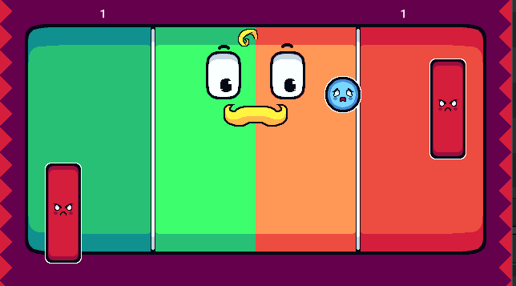

# PONG

Este é o meu primeiro projeto de jogo criado com GameMaker Studio, uma releitura do clássico Pong.

## Visão Geral do jogo

### Objetivo
Vencer o oponente fazendo 2 pontos.

### Modo de Jogo
* ***1 Jogador:** Joga-se contra uma Inteligência Artificial (AI).
* **2 Jogdores:** JOga-se um contra o outro.

#### Screenchot do jogo

> **Nota:** A bola aumenta aumenta a velocidade de acordo com o tempo que permanece no jogo.

## Controles (Gameplay)
Raquete 1: W - para cima e A para baixo
Raquete 2 (em modo 2 jogadores): seta para cima e seta para baixo

## Gostaria de expressar minha gratidão a:
* **NoNeClass:** Pelo excelente curso e suporte durante o aprendizado do GameMaker Studio e professor NoNe.
* **@crickkin:** Pela incrível arte ferita do jogo.
